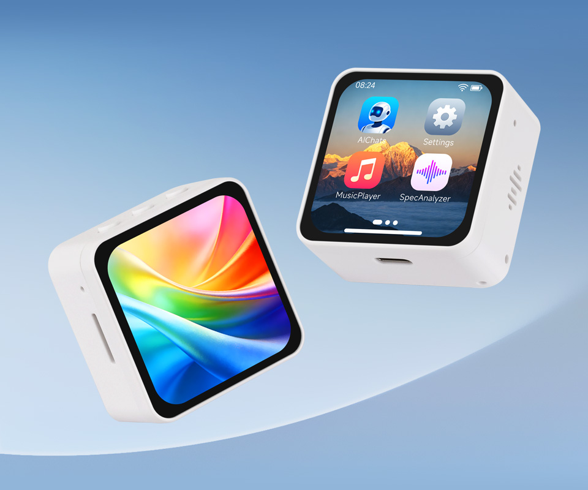

  <h1>ESP32-S3-Touch-AMOLED-2.16</h1>
  
<strong>ESP32-S3 2.16-inch 480 × 480 QSPI AMOLED touch development board</strong>

  

  

    
    
    
  

  
<a href="README_ZH.md">简体中文</a>

  

    <a href="https://www.waveshare.com/esp32-s3-touch-amoled-2.16.htm">🌐 Product Page</a> ·
    <a href="firmware/README.md">📦 Firmware</a> ·
    <a href="examples/esp-idf/">🧩 ESP-IDF Examples</a> ·
    <a href="examples/arduino/">🔧 Arduino Examples</a> ·
    <a href="docs/repository-structure.md">📚 Documentation</a>
  

---

## ✨ Overview

This single-product repository provides first-party ESP-IDF and Arduino examples,
factory recovery firmware, schematics, and mechanical references for the
Waveshare ESP32-S3-Touch-AMOLED-2.16.

## 🖥️ Hardware Overview

| Feature | Device / interface |
| --- | --- |
| MCU | ESP32-S3 |
| Display | 2.16-inch 480 × 480 QSPI AMOLED (CO5300) |
| Touch | CST9220 capacitive touch controller |
| Power and motion | AXP2101 and QMI8658 |
| Audio | ES7210 ADC and ES8311 codec |
| Board support | `waveshare/esp32_s3_touch_amoled_2_16` `^2.0.1` |
| Hardware files | [Schematic](schematic/) and [dimensions](dimensions/) |

## 📦 Firmware

The checked-in factory image is an immutable recovery delivery, not an example
build output. See [Firmware and factory recovery](docs/firmware.md); source and
build instructions for the factory image are not included in this repository.

## 🧪 Examples and toolchains

Five first-party ESP-IDF projects are tested with ESP-IDF `v5.5.5` and `v6.0.2`.
Seven first-party Arduino sketches are tested with Arduino-ESP32 `3.3.11`.
Bundled library examples are intentionally excluded from the product matrix.

- [ESP-IDF examples](examples/esp-idf/)
- [Arduino examples](examples/arduino/)
- [Continuous integration](docs/ci.md)

## 📚 Documentation

- [Repository structure](docs/repository-structure.md)
- [Components and compatibility](docs/components.md)
- [Firmware boundary](docs/firmware.md)
- [Brookesia notes](docs/brookesia.md)
- [Release tools](releases/README.md)

## 🗂️ Repository layout

`examples/` contains first-party source projects; `firmware/` contains the
separate factory delivery; `releases/` contains packaging helpers. See the
[structure guide](docs/repository-structure.md) for CI scope and ownership.

## 🤝 Support and contributions

Use [SUPPORT.md](SUPPORT.md) for product help and [CONTRIBUTING.md](CONTRIBUTING.md)
for contribution expectations. Security reporting is intentionally not described
here because this repository has no verified private reporting channel.

## 📄 License

This repository is licensed under the Apache License 2.0. See [LICENSE](LICENSE).
